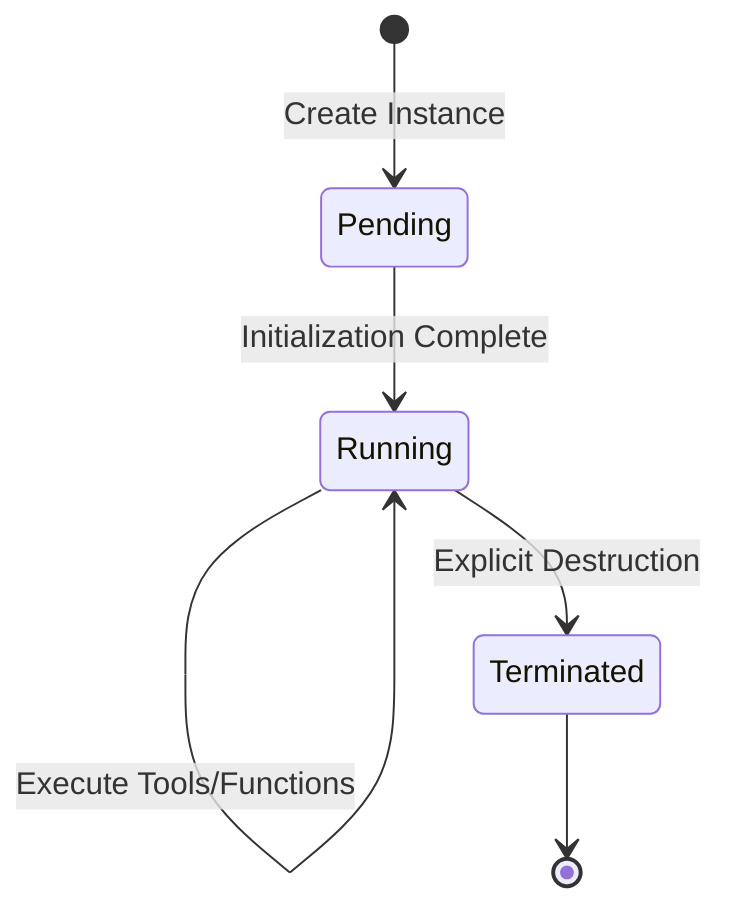

# Core Concepts

Understanding the key architectural concepts in AEnvironment.

## AEnvironment

**Overview:**
AEnvironment is an **Environment-as-Code** development framework that enables you to define reusable environments using Python for Agent construction and Reinforcement Learning (RL) training. It natively supports the Model Context Protocol (MCP) and enables one-click deployment to cloud environments.

```text
┌─────────────────────────────────────┐
│           Environment               │
│  ┌─────────────┐  ┌─────────────┐   │
│  │    Meta     │  │   Docker    │   │
│  │   (JSON)    │  │   Image     │   │
│  └─────────────┘  └─────────────┘   │
│  ┌─────────────┐  ┌─────────────┐   │
│  │ MCP Servers │  │ Reward Fns  │   │
│  └─────────────┘  └─────────────┘   │
└─────────────────────────────────────┘
```

With AEnvironment, you can:

1. **Rapid Environment Definition**: AEnvironment serves as a **tool and method carrier**, supporting flexible extension through dependency injection and other mechanisms.

2. **Simple and Convenient Integration**: Quickly integrate with various mainstream training frameworks (such as Ray, Stable-Baselines3).

3. **Flexible Capability Extension**:
   - **Tool Collection**: Callable tools registered via the `@register_tool` decorator.
   - **Reward Functions**: RL evaluation logic defined via the `@register_reward` decorator.
   - **Custom Functions**: Auxiliary functions registered via `@register_function`.

**Usage:**

```python
from aenv import Environment

async with Environment("my-env") as env:
    # Environment instance is up and running
    tools = await env.list_tools()
```

## Environment vs Environment Instance

**Environment** and **Environment Instance** are the two core concepts in this framework. Their relationship can be compared to **Class** and **Object** in Java:

- **Environment** is a **metadata template** that defines the core capabilities, resource configuration, and behavioral specifications of an environment.
- **Environment Instance** is a **runtime entity** that carries specific execution states, context data, and session information.

This design achieves effective separation between **declarative definition** and **imperative execution**, providing the system with excellent maintainability, reusability, and isolation.

```text
+------------------+       +------------------------+       +---------------------+
|                  |       |                        |       |                     |
|   Environment    | ----> | Environment Instance   | ----> | Environment Sandbox |
| (Defines Resources & |       | (Executes Specific |       | (Provides Isolated  |
|   Capabilities)  |       |   Business Logic)    |       |   Execution Env)    |
+------------------+       +------------------------+       +---------------------+
        ↑                           ↑                                ↑
        | Defines                   | Starts & Runs                  | Hosts & Isolates
        └──────────────────────────┴───────────────────────────────┘
```

## Environment Instance vs Environment Service

AEnvironment supports two deployment modes for different use cases:

### Environment Instance

**Purpose**: Temporary, on-demand compute resources for short-lived tasks.

**Key Characteristics:**

- **Time-to-Live (TTL)**: Automatic cleanup after specified duration (default: 30 minutes)
- **Ephemeral**: Designed for temporary workloads
- **Single Pod**: Runs as a single Kubernetes Pod
- **No Persistence**: No built-in persistent storage support
- **Auto-cleanup**: Automatically released when TTL expires or task completes
- **Use Cases**:
  - Development and testing
  - CI/CD pipeline jobs
  - One-time data processing tasks
  - Temporary agent interactions

**Management Commands:**

```bash
# Create temporary instance (auto-releases after TTL or command exit)
aenv instance create myenv@1.0.0 --ttl 1h

# List running instances
aenv instance list

# Delete instance
aenv instance delete instance-id
```

### Environment Service

**Purpose**: Long-running, production-grade deployments for persistent services.

**Key Characteristics:**

- **No TTL**: Runs indefinitely until explicitly deleted
- **Multiple Replicas**: Support for horizontal scaling (1-N replicas)
- **Persistent Storage**: Built-in PVC (PersistentVolumeClaim) support
- **Kubernetes Service**: Cluster DNS service URL for load balancing
- **High Availability**: Replica management for fault tolerance
- **Production-Ready**: Designed for production workloads
- **Use Cases**:
  - Production agent services
  - Long-running API servers
  - Stateful applications requiring persistent data
  - Multi-tenant service deployments

**Management Commands:**

```bash
# Create persistent service with 3 replicas
aenv service create myapp@1.0.0 --replicas 3

# Create service with persistent storage
aenv service create myapp@1.0.0 --enable-storage

# List running services
aenv service list

# Update service (scale, image, env vars)
aenv service update service-id --replicas 5

# Delete service (keeps storage by default)
aenv service delete service-id
```

### Comparison Matrix

| Feature | Environment Instance | Environment Service |
|---------|---------------------|---------------------|
| **Lifetime** | Temporary (TTL-based) | Persistent (no TTL) |
| **Replicas** | Single Pod | Multiple Replicas (1-N) |
| **Storage** | No persistent storage | PVC support (optional) |
| **Service URL** | Direct Pod IP | Cluster DNS service URL |
| **Scaling** | Not supported | Horizontal scaling supported |
| **Use Case** | Development, testing, short tasks | Production, long-running services |
| **Auto-cleanup** | Yes (TTL or manual) | No (manual deletion only) |
| **Resource Isolation** | Pod-level | Deployment + Service |
| **Cost Model** | Pay per use (TTL-based) | Continuous running |

### When to Use Which?

**Choose Environment Instance when:**

- Running temporary development or test workloads
- Executing one-time data processing jobs
- Testing environment configurations
- Running CI/CD pipeline steps
- Need automatic resource cleanup

**Choose Environment Service when:**

- Deploying production applications
- Need high availability and load balancing
- Require persistent data storage
- Running long-term agent services
- Need to scale horizontally
- Require predictable service endpoints

### Environment

An environment is a **static definition** that contains all metadata, configuration items, and component declarations required for agent operation. It describes what capabilities the environment "possesses" and what resources it "needs", but contains no runtime state.

**Core Features:**

- **Metadata Container**: Stores basic information such as environment name, version, and description.
- **Capability Declaration**: Functional components registered via decorators (e.g., `@register_tool`, `@register_reward`).
- **Configuration Specification**: Runtime constraints including protocol version, timeout policies, and resource quotas (CPU/memory).
- **Immutability**: Once published, the environment definition content is typically immutable, with evolution managed through versioning.
- **Reusability**: The same environment definition can be shared and referenced by multiple environment instances.

### Environment Instance

An environment instance is the **concrete runtime entity** of an environment template. When an environment is actually used, the system dynamically creates corresponding instances based on its definition.

**Core Characteristics:**

- **State Carrier**: Maintains dynamic runtime states such as session context, execution history, and temporary data.
- **Resource Allocation**: Allocates specific computing resources, network ports, storage volumes, etc.
- **Parameterized Configuration**: Supports passing runtime parameters during instantiation to override default configurations in the environment template.
- **Isolation**: Each instance runs in an independent **execution environment (sandbox)** to ensure instances do not interfere with each other.

### Environment Sandbox

The environment sandbox provides an **isolated and secure** execution environment for each environment instance. At the implementation level, it typically manifests as one or more containers responsible for actually executing business logic.

## Tools

**Tools** are the smallest **executable units** in AEnvironment. Tools are functions that can be called by agents through the MCP protocol.

```python
from aenv import register_tool

@register_tool
def my_tool(param1: str, param2: int = 42) -> dict:
    """Tool description for LLMs.

    Args:
        param1: Description of param1
        param2: Description of param2

    Returns:
        Execution result dictionary
    """
    return {"result": f"Processed {param1}"}
```

## Reward Functions

In Reinforcement Learning (RL) training scenarios, environments can define **reward functions** to evaluate the effectiveness of agent actions:

```python
from aenv import register_reward

@register_reward
def code_quality_reward(code: str, test_results: dict) -> float:
    """Calculate reward value based on code quality.

    Returns:
        Reward value between -1 and 1.
    """
    if test_results["passed"]:
        return 1.0
    return -0.5
```

## Custom Functions

Auxiliary functions registered via `@register_function` to support complex logic orchestration within the environment.

## Environment Lifecycle



## Registry

The **Registry** is a global **environment catalog service** for storing and managing all available environment definitions.

### EnvHub

EnvHub is the central registry service responsible for storing:

- Environment definitions (metadata and configuration)
- Tool and function metadata
- Version history and dependencies
- Access control policies

```bash
# Push local environment to registry
aenv push my-env
```

## Deployment Modes

### Local Mode

In local mode, all components run within the local development environment.

**Execution Flow:**

1. **Start Local Environment Sandbox**: In the command line, from the environment project root directory (containing `config.json`), execute:

   ```bash
   aenv run --quiet
   ```

   This command starts the environment sandbox locally and injects tools, functions, etc. The service listens on `http://127.0.0.1:(8080 & 8081)` by default.
2. **Create Environment Instance**: Use the environment variable `DUMMY_INSTANCE_IP` to specify the actual underlying runtime address associated with this environment instance.

3. **Create Environment Instance**:

   ```python
   from aenv import Environment

   async with Environment("my-env") as env:
      # Now you can use this environment instance
      tools = await env.list_tools()
   ```

4. **Release Environment**: After completing operations, terminate the local process to release environment resources.

### Remote Mode

In remote mode, all components are deployed and run in a **Kubernetes** cluster. The environment component controller is responsible for creating, scheduling, and destroying environment sandboxes.

**Operation Process:**

1. **Create Instance**:

   ```python
   from aenv import Environment
   import os

   # Set AEnvironment system service endpoint
   os.environ["AENV_SYSTEM_URL"] = "http://aenv-service/"
   mini_terminal = Environment("mini-terminal@1.0.1", timeout=180)
   ```

2. **Release Instance**: After execution is complete, call `mini_terminal.release()` to release the instance and all associated resources with one click.

## Next Steps

- {doc}`../architecture/architecture` - System architecture
