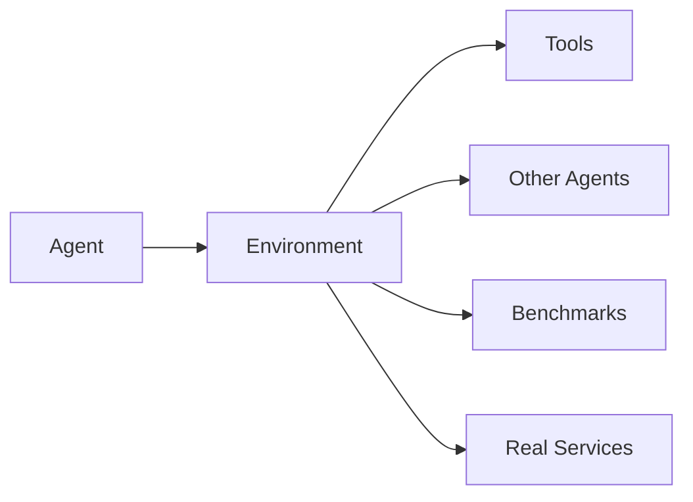

# AEnvironment

**Everything as Environment** — A production-grade environment platform for Agentic Reinforcement Learning.

## What is AEnvironment?

AEnvironment (AEnv) is a unified environment platform designed for the Agentic RL era. It provides a complete solution for:

- 🎯 **Model Benchmarking**: Built-in support for popular benchmarks (TAU, SWE-bench, etc.)
- 🚀 **RL Training at Scale**: Seamless integration with RL frameworks (AReaL, VERL, SLIME)
- 🤖 **Agent Development**: Rich tooling for building and testing AI agents
- 🔧 **Custom Environments**: Easy-to-use SDK for creating new environments

## Design Philosophy

### Everything as Environment

AEnvironment treats everything as an environment — from simple tools to complex multi-agent systems. This unified abstraction enables:



- **Composability**: Environments can be nested and composed
- **Interoperability**: Standard MCP protocol for tool communication
- **Scalability**: From local development to distributed clusters

### Agent as Environment

A unique feature of AEnvironment is treating agents themselves as environments. This enables:

- **A2A (Agent-to-Agent)**: Agents can interact with other agents as environments
- **Multi-Agent Systems**: Build complex agent ecosystems
- **Agent Testing**: Use agents to test other agents

## Key Features

::::{grid} 2
:gutter: 3

:::{grid-item-card} 🎯 Zero-Cost Benchmark Integration
Built-in support for mainstream benchmarks. Get started with SWE-bench, TAU, and more in minutes.
:::

:::{grid-item-card} ⚡ High Performance
Optimized runtime delivers fast environment creation compared to traditional container solutions.
:::

:::{grid-item-card} 🔌 MCP Protocol Support
Full compatibility with Model Context Protocol for seamless tool integration.
:::

:::{grid-item-card} 🛠️ 30-Second Development
From code to running environment in 30 seconds with our SDK and CLI tools.
:::

:::{grid-item-card} 🤖 Agent Framework Integration
Native support for OpenAI Agents, CAMEL, and other popular agent frameworks.
:::

:::{grid-item-card} 📦 Production Ready
Battle-tested infrastructure powering Ant Group's AI applications.
:::

::::

## Quick Example

```python
from aenv import Environment, register_tool

# Define a tool
@register_tool
def search_code(query: str, max_results: int = 10) -> list:
    """Search code in the repository."""
    return [{"file": "main.py", "line": 42, "content": "..."}]

# Use the environment
async with Environment("swe-env") as env:
    # List available tools
    tools = await env.list_tools()

    # Call a tool
    result = await env.call_tool("search_code", {"query": "bug fix"})
    print(result.content)
```

## Architecture Overview

AEnvironment adopts a layered architecture design, dividing the system into two core domains: the **Development Side** and the **Traffic Side**, achieving decoupling between environment development and runtime execution.

### Core Characteristics

- **Architecture Design**: Development side defines environments, traffic side executes runtime, providing unified interfaces based on MCP protocol
- **Extensibility**: Supports extensible sandbox engines such as Kubernetes
- **Metadata-Driven**: Environment configurations are stored in EnvHub, queried dynamically at runtime, supporting environment version management and rapid iteration


### Development Side

Responsible for environment definition and metadata management:

- **Flow**: AEnv CLI → EnvHub → Redis
- Developers push environment configurations to EnvHub through CLI, with metadata stored in Redis

### Traffic Side

Responsible for creating and managing runtime environment instances:

- **Flow**: AEnv SDK → API Service → Controller/Other Sandbox Engine → Environment Sandbox
- Users create environment instances through SDK, API Service queries EnvHub for metadata, and creates instances through sandbox engines (e.g., Kubernetes)
- Tool invocations are proxied by API Service to SDK within the sandbox, executing MCP tools and returning results

## Getting Started

Ready to dive in? Check out our {doc}`getting_started/quickstart` guide to create your first environment in minutes.

```{tableofcontents}
```
