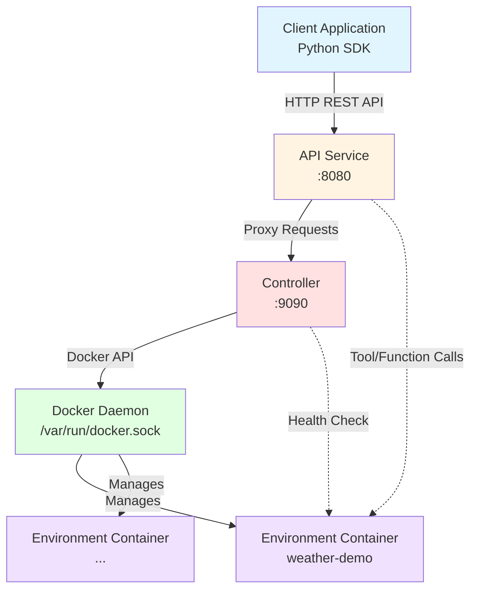

# AEnvironment Docker Engine Mode - Quick Start Guide

> **Complete example demonstrating how to run AEnvironment using Docker Engine for local development and simple deployments**

## Table of Contents

- [Overview](#overview)
- [Quick Start](#quick-start)
- [Architecture](#architecture)
- [Prerequisites](#prerequisites)
- [Detailed Usage](#detailed-usage)
- [API Examples](#api-examples)
- [Troubleshooting](#troubleshooting)
- [Docker vs Kubernetes Mode](#docker-vs-kubernetes-mode)

## Overview

This example demonstrates how to use **AEnvironment with Docker Engine** instead of Kubernetes. This mode is ideal for:

- 🚀 **Local Development**: No Kubernetes cluster required
- 🧪 **Testing**: Quick iteration cycles
- 📦 **Simple Deployments**: Single-node or small-scale deployments
- 🎯 **CI/CD Integration**: Lightweight containerized testing
- 💻 **Edge Computing**: Resource-constrained environments

### What's Included

- **Controller Service**: Manages Docker containers as environment instances
- **API Service**: Provides REST API for environment lifecycle management
- **Weather Demo**: Complete example environment with tools, functions, and rewards
- **Automation Scripts**: One-command setup, demo, and cleanup

## Quick Start

### 3-Minute Setup

#### Option 1: Using aenv CLI (Recommended)

```bash
# 1. Install aenv CLI
cd aenv
pip install -e .

# 2. Navigate to the example directory
cd ../examples/docker_all_in_one

# 3. Start services
./scripts/start.sh

# 4. Build and run the demo using aenv CLI
cd weather-demo
aenv build
cd ..
python3 weather-demo/run_demo.py
```

#### Option 2: Using Docker directly

```bash
# 1. Navigate to the example directory
cd examples/docker_all_in_one

# 2. Start services (automatically builds images if needed)
./scripts/start.sh

# 3. Build and run the demo
docker build -t aenv/weather-demo:1.0.0-docker ./weather-demo
python3 weather-demo/run_demo.py
```

### Or Use the Full Demo Script

```bash
# One command to run everything
./scripts/demo.sh
```

This will:

1. ✅ Start Controller + API Service
2. ✅ Build the weather-demo image
3. ✅ Run the demo client
4. ✅ Show container status and logs

## Architecture

### Component Diagram



### Key Components

| Component | Port | Purpose |
|-----------|------|---------|
| **Controller** | 9090 | Docker engine adapter, container lifecycle management |
| **API Service** | 8080 | Client-facing REST API, request proxying |
| **Docker Daemon** | unix socket | Container runtime (shared with host) |
| **Environment Containers** | Dynamic | User-defined environments (e.g., weather-demo) |

### How It Works

1. **Client** sends environment creation request to API Service
2. **API Service** forwards request to Controller
3. **Controller** creates Docker container using the specified image
4. **Container** runs the environment with registered tools/functions
5. **Client** can call tools/functions via API Service → Container
6. **Controller** manages container lifecycle (TTL, cleanup, health checks)

## Prerequisites

### Required

- **Docker Engine** 20.10+ ([Install Docker](https://docs.docker.com/get-docker/))
- **Docker Compose** v2.0+ (included with Docker Desktop)
- **Python** 3.12+ (for demo client)

### Recommended

- **aenv CLI** - For easier environment building and management

  ```bash
  cd aenv
  pip install -e .
  ```
  
  **Benefits of using aenv CLI**:
  - Automatic image tagging based on config.json
  - Build progress tracking with rich UI
  - Integrated registry push support
  - Config validation

### Optional

- **curl** - for manual API testing

### Verify Installation

```bash
# Check Docker
docker --version
docker-compose --version

# Check Python
python3 --version

# Check aenv CLI (if installed)
aenv --version

# Check Docker daemon is running
docker ps
```

## Detailed Usage

### 1. Start Services

```bash
./scripts/start.sh
```

**What happens:**

- Checks Docker daemon is running
- Creates `.env` file from `env.example` (if needed)
- Builds Controller and API Service images (if not present)
- Starts services with `docker-compose up -d`
- Waits for health checks to pass
- Prints service URLs and test commands

**Output:**

```
✓ Docker daemon is running
✓ Starting AEnvironment services...
✓ Controller started on http://localhost:9090
✓ API Service started on http://localhost:8080
```

### 2. Build Your Environment

The weather-demo is a sample environment that demonstrates:

- **Tools**: `get_weather(city)` - Get weather data
- **Functions**: `get_weather_func(city)` - Function version
- **Rewards**: `is_good_weather(city)` - Boolean reward

#### Option A: Using aenv CLI (Recommended)

```bash
# Install aenv CLI if not already installed
cd ../../aenv
pip install -e .
cd ../examples/docker_all_in_one

# Build using aenv CLI
cd weather-demo
aenv build

# Or use the build script
cd ..
./scripts/build_with_cli.sh
```

#### Option B: Using Docker directly

```bash
cd weather-demo
docker build -t aenv/weather-demo:1.0.0-docker .
```

**Note**: The `demo.sh` script automatically detects if aenv CLI is available and uses it; otherwise, it falls back to docker build.

### 3. Use the Environment

#### Option A: Using Python SDK

```python
from aenv import Environment
import os

os.environ["AENV_SYSTEM_URL"] = "http://localhost:8080/"

async with Environment("weather-demo@1.0.0-docker") as env:
    # List tools
    tools = await env.list_tools()
    
    # Call a tool
    weather = await env.call_tool("get_weather", {"city": "Beijing"})
    
    # Call a function
    result = await env.call_function("get_weather_func", {"city": "Shanghai"})
    
    # Call a reward
    is_good = await env.call_reward({"city": "Hangzhou"})
```

#### Option B: Using the Demo Script

```bash
python3 weather-demo/run_demo.py
```

**Expected Output:**

```
============================================================
  AEnvironment Docker Engine Demo
============================================================
API Service: http://localhost:8080/

============================================================
  Creating Environment Instance
============================================================
Environment: weather-demo@1.0.0-docker
✓ Environment instance created

============================================================
  Calling Tools
============================================================

[get_weather('Beijing')]
Response: {'city': 'Beijing', 'temperature': '20', 'description': 'Weather in Beijing', 'humidity': '65%'}
```

### 4. Monitor Containers

```bash
# List all AEnv containers
docker ps --filter "label=aenv.env_name"

# View Controller logs
docker-compose logs -f controller

# View API Service logs
docker-compose logs -f api-service

# Inspect a specific environment container
docker logs <container_id>
```

### 5. Stop Services

```bash
# Stop services only
./scripts/stop.sh

# Stop and cleanup all AEnv containers
./scripts/stop.sh --cleanup
```

## API Examples

### Using curl

#### 1. Health Check

```bash
# Controller health
curl http://localhost:9090/health

# API Service health
curl http://localhost:8080/health
```

#### 2. Create Container (Direct Controller API)

```bash
curl -X POST http://localhost:9090/containers \
  -H "Content-Type: application/json" \
  -d '{
    "env_name": "test-env",
    "image": "nginx:alpine",
    "ttl": 3600
  }'
```

**Response:**

```json
{
  "code": 200,
  "msg": "Container created successfully",
  "data": {
    "container_id": "abc123...",
    "container_name": "aenv-test-env-xyz",
    "status": "running",
    "ip": "172.18.0.5",
    "ports": {...}
  }
}
```

#### 3. List Containers

```bash
curl http://localhost:9090/containers
```

#### 4. Get Container Info

```bash
curl http://localhost:9090/containers/test-env
```

#### 5. Delete Container

```bash
curl -X DELETE http://localhost:9090/containers/test-env
```

## Troubleshooting

### Docker Daemon Not Running

**Error:**

```
Error: Docker daemon is not running. Please start Docker first.
```

**Solution:**

- macOS/Windows: Start Docker Desktop
- Linux: `sudo systemctl start docker`

### Port Already in Use

**Error:**

```
Error starting userland proxy: listen tcp4 0.0.0.0:9090: bind: address already in use
```

**Solution:**

```bash
# Find process using port 9090
lsof -i :9090

# Kill the process or change port in docker-compose.yml
```

### Controller Fails to Start

**Error:**

```
Error: Controller failed to start within 30 seconds
```

**Solutions:**

1. Check Docker socket permissions:

   ```bash
   ls -la /var/run/docker.sock
   ```

2. View detailed logs:

   ```bash
   docker-compose logs controller
   ```

3. Verify ENGINE_TYPE is set:

   ```bash
   docker-compose exec controller env | grep ENGINE_TYPE
   ```

### Image Not Found

**Error:**

```
Warning: aenv-controller:latest image not found
```

**Solution:**

The `start.sh` script will automatically build the images for you. If you want to build them manually:

```bash
# Build from project root (required due to go.work and multi-module dependencies)
cd ../..

# Build Controller
docker build -f controller/Dockerfile -t aenv-controller:latest .

# Build API Service
docker build -f api-service/Dockerfile -t aenv-api-service:latest .

# Return to example directory
cd examples/docker_all_in_one
```

**Note**: Controller and API Service Dockerfiles must be built from the project root because they depend on:

- `go.work` (Go workspace file)
- Multiple modules: `controller/`, `api-service/`, `envhub/`

### Container Exits Immediately

**Error:**

```
Container status: Exited (0)
```

**Explanation:**

- This is expected for images without a long-running process (e.g., `alpine`)
- The weather-demo image should run `python -m aenv.server` which stays alive

**Solution:**

- Ensure your Dockerfile has a proper CMD: `CMD ["python", "-m", "aenv.server"]`

### Weather Demo Image Not Found

**Error:**

```
Error response from daemon: No such image: aenv/weather-demo:1.0.0-docker
```

**Solution:**

Build the weather-demo image first:

```bash
# Option 1: Using aenv CLI (recommended)
cd weather-demo
aenv build

# Option 2: Using docker build
cd weather-demo
docker build -t aenv/weather-demo:1.0.0-docker .
```

### Permission Denied on Scripts

**Error:**

```
bash: ./scripts/start.sh: Permission denied
```

**Solution:**

```bash
chmod +x scripts/*.sh
```

## Docker vs Kubernetes Mode

| Feature | Docker Mode | Kubernetes Mode |
|---------|-------------|-----------------|
| **Setup Complexity** | ⭐ Low (Docker only) | ⭐⭐⭐ High (K8s cluster) |
| **Startup Time** | ⚡ Fast (<10s) | 🐢 Slower (scheduling overhead) |
| **Resource Isolation** | 📦 Container-level | 🏗️ Pod + Namespace |
| **Multi-Tenancy** | ❌ Not supported | ✅ Full support |
| **High Availability** | ❌ Single-node only | ✅ Replica sets, auto-healing |
| **Horizontal Scaling** | ❌ Limited to host | ✅ Cluster-wide |
| **Load Balancing** | ⚠️ Manual | ✅ Built-in (Services) |
| **Service Discovery** | ⚠️ IP-based | ✅ DNS-based |
| **Persistent Storage** | 📁 Docker volumes | 💾 PersistentVolumes |
| **Networking** | 🌐 Bridge network | 🌐 CNI plugins |
| **Security** | ⚠️ Host Docker access | ✅ RBAC, Network Policies |
| **Best For** | Dev, Test, Small deployments | Production, Large-scale |

### When to Use Docker Mode

✅ **Use Docker Mode when:**

- Developing locally
- Running integration tests in CI/CD
- Deploying to single-node servers
- Learning AEnvironment
- Prototyping environments
- Resource-constrained edge devices

❌ **Avoid Docker Mode for:**

- Production multi-tenant systems
- High-availability requirements
- Large-scale deployments (>10 concurrent environments)
- Strict isolation and security requirements

## Configuration

### Environment Variables

Edit `env.example` (or `.env` after first run):

```bash
# Docker Registry
DOCKER_REGISTRY=docker.io

# Controller Image
CONTROLLER_IMAGE=aenv-controller:latest

# API Service Image
API_SERVICE_IMAGE=aenv-api-service:latest

# Container TTL (seconds)
CACHE_TTL_SECONDS=1800

# Default Network
DEFAULT_NETWORK=aenv-network
```

### Docker Compose Overrides

Create `docker-compose.override.yml` for local customizations:

```yaml
version: '3.8'

services:
  controller:
    environment:
      - CACHE_TTL_SECONDS=3600
      - LOG_LEVEL=debug
```

## Project Structure

```
examples/docker_all_in_one/
├── README.md                      # This file
├── IMPLEMENTATION.md              # Implementation summary
├── AENV_CLI_GUIDE.md             # aenv CLI usage guide
├── BUILD_REFERENCE.md            # Docker build quick reference
├── UPDATE_AENV_CLI.md            # aenv CLI integration update
├── docker-compose.yml             # Service orchestration
├── env.example                    # Environment variable template
├── aenv-config.yaml              # aenv CLI configuration
├── .gitignore                     # Git ignore rules
├── scripts/
│   ├── start.sh                   # Start services
│   ├── stop.sh                    # Stop services (with --cleanup option)
│   ├── demo.sh                    # Full automated demo (auto-detects aenv CLI)
│   ├── build_with_cli.sh         # Build using aenv CLI explicitly
│   └── validate.sh                # Structure validation
├── weather-demo/                  # Example environment
│   ├── Dockerfile                 # Environment image
│   ├── requirements.txt           # Python dependencies
│   ├── config.json                # Environment metadata
│   ├── run_demo.py                # Demo client script
│   └── src/
│       ├── __init__.py
│       └── custom_env.py          # Tool/function/reward definitions
└── docs/
    └── architecture.md            # Detailed architecture docs
```

## Next Steps

1. **Create Your Own Environment**:
   - Copy `weather-demo/` as a template
   - Modify `src/custom_env.py` with your tools/functions
   - Update `config.json` with your metadata
   - Build with `aenv build` or `docker build`
   - Test locally

2. **Learn aenv CLI**:
   - Read [AENV CLI Guide](./AENV_CLI_GUIDE.md) for detailed usage
   - Benefits: Auto-tagging, progress UI, registry integration
   - Install: `cd ../../aenv && pip install -e .`

3. **Explore Advanced Features**:
   - Multi-container environments (Docker Compose support)
   - Custom networks and volumes
   - Resource limits (CPU, memory)
   - Health checks and readiness probes

4. **Read More Documentation**:
   - [Docker Engine Architecture](./docs/architecture.md)
   - [Controller Implementation](../../docs/README_DOCKER_IMPLEMENTATION.md)
   - [API Reference](../../docs/api/README.md)

5. **Scale to Production**:
   - Migrate to Kubernetes mode for production
   - See `examples/all_in_one` for K8s-based deployment
   - Read [Architecture Documentation](../../docs/architecture/architecture.md)

## Contributing

Found an issue or have a suggestion? Please open an issue or submit a pull request!

## License

See [LICENSE](../../LICENSE) for details.

---

**Happy building with AEnvironment Docker Engine Mode! 🐳🚀**
